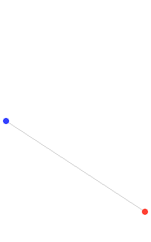

# Missile Simulator

A 3D missile simulation built with **Java** and **JMonkeyEngine**, featuring simplified physics for **ballistic missile** and **anti-ballistic missile**.

## Table of Contents
- [Project Overview](#project-overview)
- [3D Model Sources](#3d-model-sources)
- [Future Plans](#future-plans)

## Project Overview
### 🚀 **Ballistic Missile Simulation**
- Simplified ballistic missile model: considers only **parabolic motion and gravity**, ignoring air resistance, Coriolis effect, and weather.
- The missile flies toward the **target city**, and when it collides with the city, an **explosion event** is triggered.

### 🛡️ **Anti-Ballistic Missile Simulation**
- **Guidance systems implemented**:
  - **Pure Pursuit** → directly follows the target’s current position.  
    This method is highly inefficient against **ballistic missiles**, since they travel at extremely high speeds.  
    For an interceptor to succeed with Pure Pursuit, it would need to be **faster than the ballistic missile itself**, which is practically impossible.
  - **Proportional Navigation** → improves on this by predicting the missile’s future trajectory and guiding the interceptor accordingly, resulting in **much higher interception success rates**.
- On successful interception, an **explosion animation** occurs at the collision point.

(Proportional Navigation algorithm)

## 3D Model Sources
- [City](https://free3d.com/3d-model/huge-city-788526.html)
- [Missile1](https://free3d.com/3d-model/missile-agm-65-maverick-52898.html)
- [Missile2](https://free3d.com/3d-model/patriot-missile-379078.html)
- [Launcher](https://free3d.com/3d-model/pac-3-missile-launcher-1443.html)

## Future Plans
- **Radar Implementation**: Currently, the anti-ballistic missile tracks the ballistic missile based only on its coordinates.  
  Future development will focus on simulating radar functionality, including:
    - **Wave propagation** for detecting targets.
    - **Doppler effect** for measuring relative velocity.
    - **Launch point prediction** and trajectory estimation based on radar signals.  
